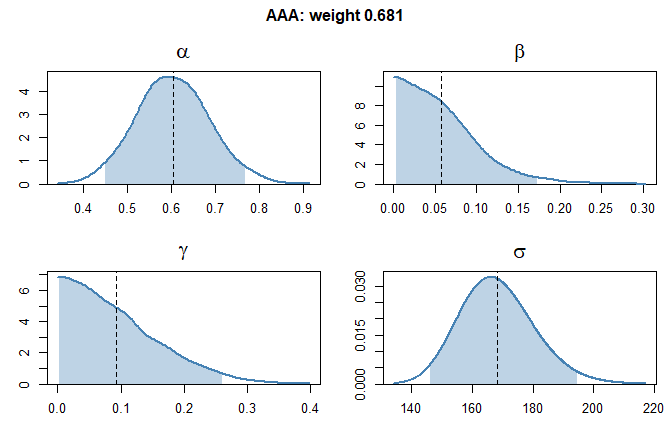
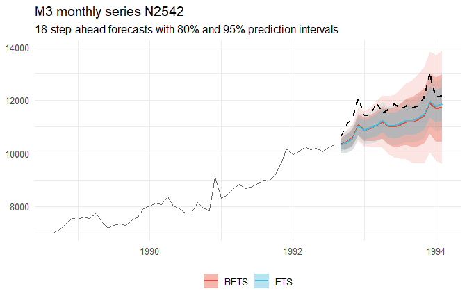

<!-- README.md is generated from README.Rmd. Please edit that file -->

# BayesETS

<!-- badges: start -->

[](https://github.com/LorenzoZambon/BayesETS/actions/workflows/R-CMD-check.yaml)
<!-- badges: end -->

**BayesETS** implements Bayesian ETS (exponential smoothing) state-space
models, which account for both parameter and model uncertainty.
Currently, only additive models are supported. Initial states and the
observation variance are analytically marginalized via conjugate
Normal-Inverse-Chi-Squared priors. The smoothing parameters
($\alpha, \beta, \gamma, \phi$) are integrated numerically, either by
adaptive Gauss-Hermite quadrature (AGHQ) or by adaptive importance
sampling (AIS). Multiple ETS models are combined by Bayesian Model
Averaging (BMA). Forecasts are generated by `predict()`, by simulating
future sample paths.

Key features:

- **Parameter uncertainty**: parameters are integrated over their
  posterior distribution, rather than estimated as point values.
- **Model uncertainty**: multiple ETS models are combined via BMA,
  rather than selecting a single one.
- **Fast**: analytical marginalization reduces the dimension of the
  integration space to (at most) 4; likelihood evaluation is vectorized
  and implemented in C++. On the M3 data, `bets()` takes on average 0.12
  s per monthly series, 0.06 s per quarterly and 0.02 s per yearly one
  (median lengths: 115, 44 and 19 observations), on one core of a laptop
  with an AMD Ryzen 5.

## Installation

You can install the development version from
[GitHub](https://github.com/LorenzoZambon/BayesETS):

``` r
# install.packages("remotes")
remotes::install_github("LorenzoZambon/BayesETS")
```

The package contains C++ code: installing it from GitHub requires a
compiler (Rtools on Windows, the Xcode command line tools on macOS, a
C++ compiler on Linux).

## Example: M3 monthly series

We fit `bets()` and `ets()` (from the forecast package) to a monthly
series of the M3 competition, and compare the fitted models and their
forecasts. `ets()` estimates the parameters of each model by maximum
likelihood and selects a single model by AICc. `bets()` fits all the
additive models and averages them, with weights given by their posterior
probabilities; within each model, it integrates over the posterior of
the parameters.

``` r
library(BayesETS)
library(forecast)   # for comparison with ets()
library(Mcomp)      # M3 competition data
library(ggplot2)    # for plot

set.seed(123)
```

``` r
series  <- M3[["N2542"]]
y_train <- series$x
y_test  <- series$xx
h       <- length(y_test)

# Fit the models
bets_fit <- bets(y_train, additive.only = TRUE)
ets_fit  <- ets(y_train, additive.only = TRUE)
```

### Fitted models

The print methods summarise the two fits:

``` r
print(ets_fit)   
#> ETS(A,A,A) 
#> 
#> Call:
#> ets(y = y_train, additive.only = TRUE)
#> 
#>   Smoothing parameters:
#>     alpha = 0.644 
#>     beta  = 1e-04 
#>     gamma = 1e-04 
#> 
#>   Initial states:
#>     l = 3195.5107 
#>     b = 75.2202 
#>     s = 313.7041 -77.6393 -157.02 -175.1816 -95.0358 -120.3575
#>            -140.7705 -33.6367 213.9919 109.4593 93.6201 68.8661
#> 
#>   sigma:  172.9557
#> 
#>      AIC     AICc      BIC 
#> 1571.474 1578.591 1616.429

print(bets_fit)
#> BETS model fit
#>   call: bets(y = y_train, additive.only = TRUE)
#>   length of the series: 104
#>   frequency: 12
#>   combination: Bayesian Model Averaging
#> 
#>   Model weights and posterior means of the parameters:
#> 
#>   model  weight  alpha   beta    phi  gamma  sigma
#>   AAA     0.681  0.604  0.057      -  0.093  168.3
#>   AAdA    0.319  0.493  0.185  0.904  0.094  169.9
#>   (weight < 0.001: ANN, AAN, AAdN, ANA)
#> 
#>   Posterior probability of trend: 1.00, damped trend: 0.32, seasonality: 1.00
```

**Models.** `ets()` selects a single model by AICc, while `bets()`
weighs each model according to its posterior probability:

``` r
ets_fit$method
#> [1] "ETS(A,A,A)"

summ_bets <- summary(bets_fit)  # summary of the fitted models
summ_bets$models
#>   model weight log_evidence
#> 1   ANN 0.0000     -718.791
#> 2   AAN 0.0003     -716.425
#> 3  AAdN 0.0001     -717.350
#> 4   ANA 0.0000     -720.138
#> 5   AAA 0.6808     -708.719
#> 6  AAdA 0.3187     -709.478
```

**Parameters.** For the model selected by `ets()`, ETS(A,A,A), we
compare the maximum likelihood estimates with the posterior distribution
of the same model in `bets()` (summarised by mean, standard deviation
and 95% credible interval):

``` r
# ets(): maximum likelihood estimates
round(c(ets_fit$par[c("alpha", "beta", "gamma")], sigma = sqrt(ets_fit$sigma2)), 4)
#>    alpha     beta    gamma    sigma 
#>   0.6440   0.0001   0.0001 172.9557

# bets(): posterior distribution
post <- summ_bets$parameters$AAA
post
#>           mean      sd     2.5%    97.5%
#> alpha   0.6039  0.0810   0.4513   0.7688
#> beta    0.0575  0.0443   0.0026   0.1733
#> gamma   0.0934  0.0709   0.0031   0.2609
#> sigma 168.2662 12.4047 146.0917 194.6515
```

We can also visualise the posterior distributions of the parameters
using `plot()`, (includes shaded 95% credible interval and dashed
posterior mean):

``` r
plot(bets_fit, models = "AAA")   # run plot(bets_fit) to see all models with non-negligible weights
```



The posterior distribution quantifies the uncertainty around the
parameter estimates. For example, `ets()` estimates $\alpha$ = 0.64,
while the 95% credible interval of `bets()` goes from 0.45 to 0.77.
`bets()` carries this uncertainty into the forecasts.

### Forecasts

Forecasts are obtained with `predict()`, by simulating future
trajectories.

``` r
bets_fc <- predict(bets_fit, h = h, level = c(80, 95))
ets_fc  <- forecast(ets_fit, h = h, level = c(80, 95))

bets_fc
#>          Point Forecast    Lo 80    Hi 80     Lo 95    Hi 95
#> Sep 1992       10347.47 10125.65 10576.63 10007.830 10705.88
#> Oct 1992       10431.83 10172.19 10717.20 10015.551 10849.69
#> Nov 1992       10599.91 10284.93 10922.95 10129.545 11098.21
#> Dec 1992       11077.88 10697.48 11480.60 10476.080 11727.03
#> Jan 1993       10873.69 10439.65 11332.33 10237.287 11566.80
#> Feb 1993       10958.58 10451.87 11451.79 10237.714 11735.42
#> Mar 1993       11054.87 10486.35 11586.41 10223.060 11959.74
#> Apr 1993       11176.24 10552.75 11751.97 10227.655 12177.85
#> May 1993       11032.88 10338.39 11681.63  9970.735 12161.40
#> Jun 1993       10990.79 10218.76 11728.57  9844.500 12210.85
#> Jul 1993       11078.31 10281.06 11858.70  9792.992 12413.55
#> Aug 1993       11180.40 10317.35 12053.98  9759.746 12616.37
#> Sep 1993       11191.44 10249.02 12128.27  9638.486 12757.27
#> Oct 1993       11271.70 10280.11 12267.34  9627.237 12954.41
#> Nov 1993       11427.05 10365.23 12474.10  9619.016 13249.91
#> Dec 1993       11889.92 10745.28 13010.91 10041.920 13824.35
#> Jan 1994       11672.68 10419.00 12865.27  9715.118 13680.66
#> Feb 1994       11743.85 10446.83 12987.54  9582.372 13887.27
```

Finally, we plot the last years of the series with the forecasts of both
models (80% and 95% prediction intervals) and the observed test set
(dashed). The intervals of `bets()` are larger, as they account for the
uncertainty on the parameters and on the model, while those of `ets()`
are conditional on the estimates of the selected model.



## Benchmark

We compare `bets()` and `ets()` (additive models only) on all the
yearly, quarterly and monthly series of the M3 data (2829 series), with
the M3 test sets (horizons 6, 8 and 18):

- **MASE**: mean absolute error of the point forecasts, scaled by the
  in-sample mean absolute error of the seasonal naive forecast;
- **Coverage** of the 80% and 95% prediction intervals;
- **MSIS**: interval score of the 95% intervals, with the same scaling
  (lower is better);
- **Time**: seconds per series (includes both fit and forecast).

<table>
<thead><tr><th>Period (series)</th><th>Method</th><th>MASE</th><th>Coverage 80%</th>
<th>Coverage 95%</th><th>MSIS</th><th>Time (s)</th></tr></thead>
<tbody>
<tr><td rowspan="2">Yearly (645)</td><td>ets</td><td align="right">2.893</td><td align="right">0.645</td><td align="right">0.780</td><td align="right">41.87</td><td align="right">0.004</td></tr>
<tr><td>bets</td><td align="right">2.872</td><td align="right">0.698</td><td align="right">0.857</td><td align="right">32.41</td><td align="right">0.022</td></tr>
<tr><td rowspan="2">Quarterly (756)</td><td>ets</td><td align="right">1.177</td><td align="right">0.690</td><td align="right">0.839</td><td align="right">11.90</td><td align="right">0.032</td></tr>
<tr><td>bets</td><td align="right">1.167</td><td align="right">0.736</td><td align="right">0.892</td><td align="right">10.30</td><td align="right">0.064</td></tr>
<tr><td rowspan="2">Monthly (1428)</td><td>ets</td><td align="right">0.880</td><td align="right">0.761</td><td align="right">0.904</td><td align="right">7.06</td><td align="right">0.135</td></tr>
<tr><td>bets</td><td align="right">0.867</td><td align="right">0.816</td><td align="right">0.943</td><td align="right">6.55</td><td align="right">0.122</td></tr>
</tbody>
</table>

The script is in [`benchmark/m3_benchmark.R`](benchmark/m3_benchmark.R).

## Current limitations

- Only additive models are supported (additive error, trend and
  seasonality).
- The series must not contain missing values.
- Exogenous regressors are not supported.
